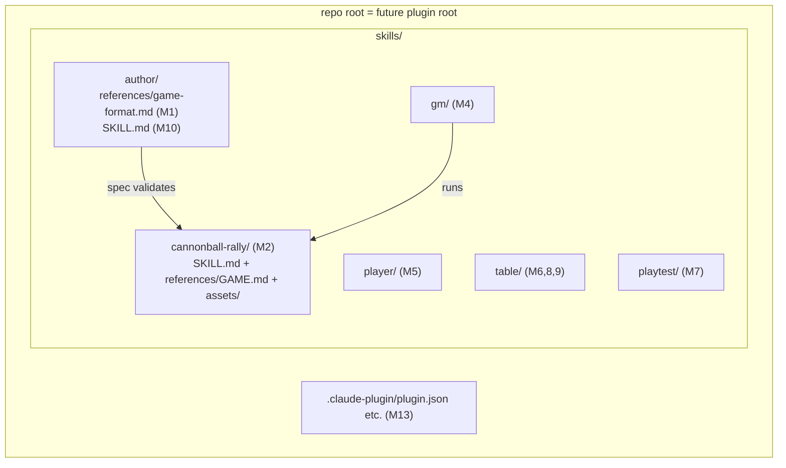

# Architecture Decision: Repo Layout

Where do engine skills, game directories, and the GAME.md format spec live? (Deferred from L4 preflight to M1.)

## Requirements & Constraints

Quality attributes, ranked:

1. **Portability** — agentskills.io-compatible skills; packages as a plugin for both Cursor and Claude (M13) with thin manifest wrappers, no file moves or build steps.
2. **Simplicity** — Markdown-first repo, single author; the layout should be boring.
3. **Extensibility** — adding a game = adding a directory (engine/content separation); no relayout in later milestones.
4. **Discoverability** — humans browsing the repo find the spec and the games easily.

Technical constraints:

- `.cursor/{rules,skills,commands}/shared/` is vendored by ai-rizz — deliverables cannot live there, and `.cursor/` generally is harness-specific dev tooling, not product.
- Each game directory is *itself a valid skill* (the portability trick) — so games and engine skills are the same kind of artifact.
- The format spec must exist from M1, before any engine skill exists, and must ship to plugin consumers (use-case 4: game authoring needs the spec at runtime).

Verified plugin facts (2026-06):

- **Claude Code**: plugins auto-discover skills from root-level `skills/<name>/SKILL.md`; only `plugin.json` lives in `.claude-plugin/`; all components at plugin root ([docs](https://code.claude.com/docs/en/plugins), [reference](https://code.claude.com/docs/en/plugins-reference)). Custom skill paths beyond `skills/` are not the default discovery path.
- **Cursor**: installed plugins in the local plugin cache use the identical shape — `<plugin>/skills/<name>/SKILL.md` plus optional `rules/` (observed directly in `~/.cursor/plugins/cache/`).

Out of scope: plugin manifest contents (M13), dev-time skill activation mechanics (first needed in M4).

## Components

## Options Evaluated

- **A: Single top-level `skills/` for everything** — engine skills and game directories side by side; repo root doubles as plugin root; spec lives at `skills/author/references/game-format.md`.
- **B: `skills/` (engine) + `games/` (content) split** — mirrors the engine/content architecture in the directory tree.
- **C: Skill directories at repo root** (`gm/`, `cannonball-rally/`, ...) — no container directory.

## Analysis

| Criterion | A: flat `skills/` | B: `skills/` + `games/` | C: root dirs |
|-----------|-------------------|-------------------------|--------------|
| Fitness (plugin w/ thin wrappers) | ✅ zero moves; both harnesses auto-discover `skills/` | ⚠️ `games/` is outside default discovery → symlinks, copies, or nonstandard manifest paths | ❌ neither harness discovers root-level skill dirs |
| Simplicity | ✅ one rule: "every skill lives in `skills/`" | ⚠️ two roots, two rules | ✅ trivially simple but wrong for packaging |
| Extensibility (add a game = add a dir) | ✅ | ✅ | ✅ |
| Discoverability | ⚠️ engine and games interleaved (mitigate via README index) | ✅ clean conceptual split | ⚠️ root clutter grows per game |
| Risk / reversibility | Low; `git mv` if ever wrong | Medium: M13 discovers the packaging pain last, after 11 milestones build on the split | Low-but-wrong; guaranteed rework at M13 |

Key insights:

- Games-are-skills is the load-bearing fact: B's conceptual split fights the portability trick that makes one install mechanism deliver both. The architecture says they're the same artifact kind; the directory tree should agree.
- Both target ecosystems converged on the same plugin shape (root `skills/`), making A's "repo root = plugin root" a zero-cost packaging story — exactly the "thin manifest wrapper, deliberately last" M13 wants.
- The discoverability loss in A is real but cheap to mitigate (README game library index; game dirs are obviously games by name).
- The format spec's runtime consumer is `author` (drafting/validation). `gm` runs *games*, not the spec — a GAME.md must stand alone (paper-first parity). So the spec belongs in `author`'s references even though the `author` SKILL.md itself only lands in M10. `docs/` was rejected because plugin consumers (use-case 4) would not receive the spec.

## Decision

**Selected**: Option A — single top-level `skills/` directory; repo root doubles as plugin root.

**Rationale**: Portability is the top-ranked attribute, and A is the only option where both verified plugin formats discover everything with zero file moves. It also encodes the games-are-skills architecture directly in the layout (one artifact kind, one home).

**Tradeoff**: Engine skills and games interleave in one directory; accepted, mitigated by README indexing and obvious naming.

## Implementation Notes

- M1 creates `skills/author/references/game-format.md` (the spec). `skills/author/` remains a reference-only directory (not yet a valid skill) until M10 adds its `SKILL.md` — harmless to both harnesses, complete before M13 packaging.
- Naming: skill directories kebab-case (`cannonball-rally`); engine skills keep their vision names (`gm`, `player`, `table`, `playtest`, `author`). Per-game well-known file is uppercase `GAME.md` (like `SKILL.md`); ordinary references are lowercase (`game-format.md`).
- Game directory shape (M2+): `skills/<game>/SKILL.md` + `references/GAME.md` + `assets/` (printables).
- Dev-time activation in Cursor (first needed M4): symlink or explicit reference from `.cursor/skills/` to `skills/<name>/` — decided then, not now; does not constrain layout.
- Migration path: none needed (greenfield); if the decision ever proves wrong, `git mv` + README/spec pointer updates are the full blast radius.
