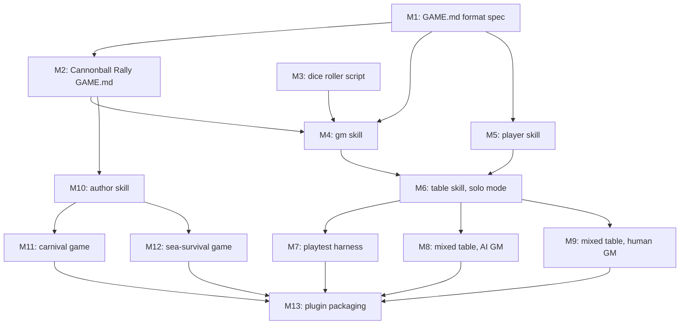

# Milestones: lite-rpg-toolkit

## Cross-milestone invariants & constraints

1. **Paper-first parity** — every game remains printable and playable with paper, pencils, and a d6; no milestone makes a computer required for play.
2. **Skills-only core** — no milestone introduces servers, custom tools, or harness-specific features into the engine; everything stays agentskills.io-compatible.
3. **Engine/content separation** — no game-specific rules hard-coded into engine skills; no engine logic embedded in game directories. Adding a game must always mean writing a document, not code.
4. **Models never roll dice** — all randomness comes from the script roller (or physically-rolled, human-reported dice declared at setup).
5. **Disk-free baseline** — only `playtest` may require a filesystem (declared via skill `compatibility`); no milestone adds a disk dependency to any other core flow.
6. **GAME.md is the single source of truth** — one document serves print and machine; no milestone introduces a separate machine-readable spec that can diverge from the printable rulebook.
7. **Vendored rules untouched** — `.cursor/{rules,skills,commands}/shared/` are managed by ai-rizz; no milestone edits them.
8. **Test-first wherever code exists** — any executable script in any milestone is developed per the always-tdd workspace rule; prose deliverables are validated by their proving milestone (the format by the rally, engine skills by recorded play sessions).

## Execution Order

- [x] M1: Author the GAME.md format specification as an engine reference (required sections, content-table conventions, external data hooks with offline fallbacks, turn-report format rules) and retire VISION.md — est. L3: foundational spec with multiple interlocking design decisions
- [ ] M2: Formalize Cannonball Rally as a complete game directory (valid skill wrapper + `references/GAME.md`), proving the format and fixing any spec gaps it surfaces — est. L2: authoring one document against the new spec, self-contained
- [ ] M3: Build the seedable dice-roller script (real RNG, per-roll context logging, reproducible seeds) with full shell TDD — est. L2: single script plus test suite, self-contained
- [ ] M4: Build the `gm` skill (mechanics applier, restated state table, turn-brief distillation, external-data hook resolution with fallback, transcript journal where disk exists), validated by a human playing all seats of Cannonball Rally and recording that session as a golden transcript fixture for later milestones — est. L3: complete feature with several coupled components
- [ ] M5: Build the `player` skill (structured single-decision output plus table talk, consuming turn brief + state table) with the shipped persona roster — est. L2: single skill with a contained decision interface
- [ ] M6: Build the `table` skill in solo mode (session setup: game/seats/humans/GM, then round-robin loop routing decisions to seats) for one human + N AI players — est. L3: orchestrator integrating gm, player, and a human seat
- [ ] M7: Build the `playtest` batch harness (N unattended AI-only games, seed/persona/rule-parameter sweeps, transcript dataset, human-readable balance report) and answer the Cannonball Rally 2hr base-stage-time question — est. L3: batch runner with sweep logic and reporting
- [ ] M8: Add mixed-table AI-GM mode to `table` (turn-report protocol, scribe flow, state-table echo as error check) plus printable Cannonball Rally reference cards in game `assets/` — est. L3: novel UX protocol spanning engine and game assets
- [ ] M9: Add mixed-table human-GM mode to `table` (players-only loop: human GM types conditions, AI seats return declarations and script-rolled dice) — est. L2: contained mode reusing existing player/table machinery
- [ ] M10: Build the `author` skill (draft GAME.md from notes, validate against the format spec, interrogate for unwritten rules) — est. L3: three distinct capabilities over the format
- [ ] M11: Draft the carnival ticket-hustling game as a complete game directory using `author` — est. L2: content authoring with existing tooling
- [ ] M12: Draft the Caribbean sea-survival game as a complete game directory using `author` — est. L2: content authoring with existing tooling
- [ ] M13: Package the repo as a plugin for Cursor and Claude (manifests delivering engine skills + game library through one mechanism) — est. L2: thin manifest wrappers, deliberately last
