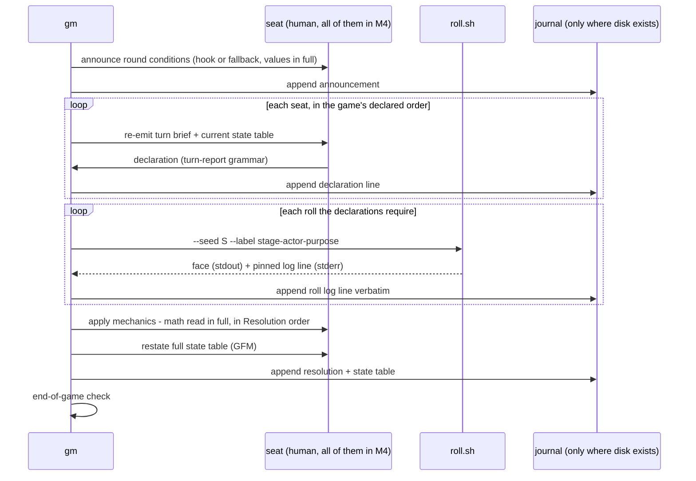

# Task: m4-gm-skill

* Task ID: m4-gm-skill
* Complexity: Level 3
* Type: feature (engine skill — primarily prose deliverable; no new executable code)

Build the `gm` skill — the engine's referee. Reads any conforming `GAME.md`, owns session
state, announces conditions, applies mechanics, restates the state table after every
recomputation, distills per-seat turn briefs, resolves external data hooks (with offline
fallback), rolls via `scripts/roll.sh`, and journals the session transcript where disk
exists. Validated by a human playing all seats of Cannonball Rally; that session is
recorded as the golden transcript fixture for later milestones.

## Pinned Info

### One round through the gm

The per-round flow every component participates in — the skill documents are organized
around this loop, and the validation session must exhibit it. (Seat = the human playing
all seats in M4; `table`/`player` take over routing in M6.)

## Component Analysis

### Affected Components

- `skills/gm/SKILL.md` (new): the skill — activation pitch + lean session workflow,
  progressive-disclosure pointers into references. Currently `skills/gm/` is a half-skill
  (only `scripts/roll.sh`); this completes it.
- `skills/gm/references/session-procedure.md` (new): the full GM procedure — session setup
  (game load, seats, dice mode, seed declaration, initial state), turn-brief distillation
  rules, the round loop, mechanics application discipline, hook resolution, human-reported
  dice, conduct rules (narration budget, math in full).
- `skills/gm/references/journal-format.md` (new): the transcript journal contract (from the
  creative decision) — the gm→M6/M7 boundary artifact.
- `skills/gm/scripts/roll.sh` (exists, unchanged): consumed as-is; its stderr grammar is
  embedded verbatim in the journal.
- `tests/fixtures/transcripts/cannonball-rally-golden.md` (new): the recorded human-played
  validation session, in journal format.
- `README.md`: gm no longer "planned" — layout tree and Status updates.
- `memory-bank/systemPatterns.md`: status-note reconciliation (gm becomes real; restated
  state table / turn brief / journal patterns become implemented facts).

### Cross-Module Dependencies

- gm ← `skills/author/references/game-format.md` (M1): every required GAME.md section must
  have a consuming gm behavior (Core Procedure → loop; Resolution → mechanics; Parameters/
  Content Tables → values; External Data Hooks → resolution; Turn Report → declaration
  grammar; GM Guidance → conduct).
- gm ← `skills/cannonball-rally/references/GAME.md` (M2): the validation game.
- gm ← `skills/gm/scripts/roll.sh` (M3): dice + the pinned log grammar.
- gm → M6 (`table`), M7 (`playtest`): the journal/golden-transcript format is their input
  contract; the turn brief is what M6 re-emits per seat.

### Boundary Changes

- New public contract: the transcript journal format (`references/journal-format.md`).
- New fixture directory convention: `tests/fixtures/` for non-shell test data.
- No changes to existing interfaces (`roll.sh`, GAME.md format, the rally) are planned;
  any spec/game gap the validation session surfaces is fixed in the paper (see Challenges).

### Invariants & Constraints (must hold)

1. Models never roll — every random number traces to a `roll.sh` log line or a declared
   physical roll transcribed in the same line shape (`seed=physical`).
2. Disk-free baseline — gm must run with no filesystem; the journal is opportunistic and
   its absence changes nothing. No `compatibility` disk requirement in SKILL.md.
3. Engine/content separation — nothing Cannonball-specific in `skills/gm/`; gm consumes
   only what the format spec guarantees of a conforming GAME.md.
4. Skills-only — agentskills.io layout (`SKILL.md` + `references/` + `scripts/`), no
   harness-specific features.
5. Conversation is the working memory — state lives in the restated table in-chat; the
   journal mirrors, never substitutes.
6. Paper-first parity — if the gm needs something the paper doesn't say, the paper gets
   fixed, never the engine.

## Open Questions

- [x] **Transcript journal & golden transcript format** → Resolved: structured Markdown
  transcript — normative skeleton (H1 session header; one H2 per round with announcement,
  declarations in the game's Turn Report grammar, verbatim `roll.sh` log lines, per-seat
  resolution arithmetic, restated GFM state table; final `## Standings`), reusing the three
  already-pinned grammars as parse anchors; golden fixture at
  `tests/fixtures/transcripts/cannonball-rally-golden.md`
  (see `memory-bank/active/creative/creative-transcript-journal-format.md`)

## Test Plan (TDD)

No new executable code → no new shunit2 tests. Per the L4 invariant ("prose deliverables
are validated by their proving milestone — engine skills by recorded play sessions"), the
test for this milestone **is** the recorded validation session, run against the behavior
checklist below, with the existing shell suite as the regression gate. The checklist is
written into the plan *first* (this section) and the session validates against it —
the prose analog of tests-before-code.

### Behaviors to Verify (session-observable, checked against the golden transcript)

- B1 Setup: gm loads the named game's `references/GAME.md`, establishes seats, dice mode
  (script vs physical), declares the session seed, and draws the initial state table per
  the game's Setup steps.
- B2 Turn brief: before each seat's decision, gm re-emits that seat's brief (decision
  procedure + that seat's applicable modifiers/abilities + turn-report grammar) so the
  context tail is always brief + state table → one decision.
- B3 Announcement: each round opens with every announced value the game's Core Procedure
  step requires (stage card fields, standard time), numbers read in full.
- B4 Hook resolution: weather resolves via the *Stage Weather* hook when network exists
  (deterministic interpretation) and via the fallback roll when not; at least the fallback
  path appears in the golden transcript (hook path too if network is available at the table).
- B5 Script-rolled dice: every roll is a `roll.sh` invocation with the session seed and a
  unique `<stage>-<actor>-<purpose>` label; the stderr line lands verbatim in the journal;
  the model never invents a number. Physical mode: human-reported faces transcribed in the
  same line shape with `seed=physical`.
- B6 Mechanics: stage time computed in the exact Resolution modifier order with the math
  read in full; police check applies *Suspicion Step* per suspect act; threshold semantics
  are beat-means-strictly-exceed; pulled-over consequences (erased penalties reapply).
- B7 State restatement: the full scoreboard is re-emitted as one GFM table after every
  recomputation, matching the journal's copy.
- B8 End state: end condition checked each round; final standings per Scoring & End State
  (jailed racers listed last as DNF, no hours).
- B9 Journal: where disk exists, the transcript follows the journal-format skeleton
  (header, per-round parts in order, standings) and supports the resume rule (each round
  ends with a state table).
- B10 Disk-free parity: with no filesystem, the session runs unchanged (verified by skill-
  text inspection + a journal-skipped dry round).
- B11 Genericity: `skills/gm/` contains nothing Cannonball-specific (verified by inspection
  + the Lemonade Stand walkthrough, step 5 below).

### Edge Cases (exercised in walkthroughs and/or the validation session)

- Stalling seat → GM offers the game's safe default (GM Guidance).
- No-roll action (Lights & Sirens!) → no roll.sh call, journal records the declaration only.
- Reaction roll (Double Down / Gun It / Blend In) → resolves at trigger, ignores police bar.
- Failed Double Down → jail → racer drops from the loop, listed DNF at standings.
- Tie on total hours → act in setup order.
- Slot with a stage choice (slot 5) → `via <stage>` declarations handled.
- Hook interpretation ambiguity → tiebreak rule applied, ruling said out loud.
- Nonconforming/missing GAME.md section → gm flags the paper as incomplete and stops
  applying improvised rules ("fix the paper, never the engine").

### Test Infrastructure

- Framework: shunit2 harness at `tests/sh/` (regression gate only; no new shell tests).
- Command: `make test` — must stay green throughout.
- New fixture home: `tests/fixtures/transcripts/` (created this milestone).
- New test files: none.

### Integration Tests

- The validation session itself is the integration test: GAME.md (M1 format, M2 content) ×
  `roll.sh` (M3) × the new gm procedure, end to end, human-verified, recorded as the
  golden transcript.

## Implementation Plan

1. ✅ **Stub the skill documents** (interface stubbing, no content yet)
    - Files: `skills/gm/SKILL.md`, `skills/gm/references/session-procedure.md`,
      `skills/gm/references/journal-format.md`
    - Changes: create with frontmatter/headings and one-line purpose statements only.
2. ✅ **Author `references/journal-format.md`** — the contract first, since the session
   procedure references it
    - Files: `skills/gm/references/journal-format.md`
    - Changes: the normative skeleton from the creative decision — file naming and
      location rule, session header fields, per-round parts in order, physical-dice line
      shape, standings, resume rule, "where disk exists" gating.
    - *(Preflight amendment)* Include a worked one-round example excerpt (Lemonade Stand,
      the spec's own illustration game) that conforms to the skeleton — the same self-test
      discipline `game-format.md` uses (every normative format ships an example that
      passes it).
    - Creative ref: `memory-bank/active/creative/creative-transcript-journal-format.md`
3. ✅ **Author `references/session-procedure.md`** — the full GM procedure
    - Files: `skills/gm/references/session-procedure.md`
    - Changes: session setup (game load + conformance expectations, seats, dice mode, seed
      declaration, initial state per the game's Setup); turn-brief distillation rules (what
      a brief contains, when re-emitted, full-GAME.md re-consult rule); the round loop
      (announce → per-seat brief + declaration → rolls → mechanics in the game's stated
      order, math in full → state restatement → end check); hook resolution procedure
      (source attempt, deterministic interpretation, fallback roll, say the ruling);
      roll-label discipline (`<stage>-<actor>-<purpose>`, uniqueness, `#i` multi-die);
      human-reported dice; conduct (narration budget, default rulings, note-for-author).
4. ✅ **Author `skills/gm/SKILL.md`** — lean activation layer
    - Files: `skills/gm/SKILL.md`
    - Changes: frontmatter (name `gm`, description covering when to activate); body: role,
      what it needs (a game's GAME.md path), session start steps, the loop in summary,
      explicit non-goals (no seat routing/personas — that's `table`/`player`), pointers to
      the two references; no `compatibility` disk requirement.
5. ✅ **Self-validation walkthroughs** (fix gaps before the human session)
    - Files: the three gm documents (revisions); no new files.
    - Changes: (a) spec cross-check — walk `game-format.md`'s required sections and confirm
      each has a consuming gm behavior; (b) genericity check — dry-run one Lemonade Stand
      round on paper against the procedure (B11); (c) edge-case desk-check against the
      list above.
6. ✅ **Operator validation session + golden transcript** (requires the operator)
    - Files: `tests/fixtures/transcripts/cannonball-rally-golden.md` (new — accepted `sonnet1`)
    - Changes: the operator plays all seats of Cannonball Rally with gm active (script
      dice, seeded); the session is journaled per the format; the transcript is saved as
      the golden fixture; defects surfaced in gm docs are fixed; any game/spec gap is
      fixed in the paper and noted for the milestone record.
    - *(Result, 2026-06-15)* 8 runs (`haiku1`–`haiku7`, then `sonnet1`); each Haiku run
      surfaced and fixed a defect (reaction-as-choice, save/bar/beat, field-keyed +
      consequence-revoked cross-check, Light-traffic clarity, format drift, Usage-cadence
      default for fabricated limits). Golden = `sonnet1`: all 6 vehicles, 48 real player
      turns, every fix exercised, jail/DNF + tied finish. Accepted **as-is, provisionally**.
    - *(Deferred defect)* No GM run journals rounds to disk (header only); behavior **B9**
      is unverified by the golden. Punted to a later milestone (operator decision) — out of
      M4 scope. See activeContext "Known Defect (deferred)".
    - *(Preflight note)* The fixture keeps a stable curated name (`cannonball-rally-golden.md`)
      rather than the runtime `<game>-<YYYYMMDD-HHmmss>.md` name — deliberate: downstream
      consumers (M6/M7) need a stable path; the session header inside still carries the date.
    - *(Operator acceptance, 2026-06-14)* The golden run must seat **all 6 vehicles**
      (Ambulance, Motorcycle, 4x4, SUV, 2-door Supercar, 4-door Sedan) → a 6-racer session.
      Reaction abilities only fire on a pull-over, so full mechanism coverage is dice-gated.
      Run 1 (seed `haiku1`) covered 4 of 6 vehicles and is a shakedown, not the keeper.
7. **Documentation + regression gate**
    - Files: `README.md`, `memory-bank/systemPatterns.md`
    - Changes: README layout tree (gm: SKILL.md + references), engine table and Status
      line updates; systemPatterns status note reconciled (gm real; state-table/turn-brief/
      journal patterns now implemented). Run `make test` (must be green).
    - *(Preflight amendment)* Also revisit `skills/cannonball-rally/SKILL.md`'s "Until
      those engine skills are available…" wording — with gm real, the sentence needs to
      distinguish available engine skills from still-planned ones.

## Technology Validation

No new technology — Markdown documents, the existing roll.sh, and the existing shunit2
harness. Validation not required.

## Challenges & Mitigations

- **Operator-in-the-loop validation (step 6)**: the build cannot finish autonomously — the
  golden transcript requires a human playing all seats. Mitigation: sequence all authoring
  and self-validation first so the operator session is the last build step; treat the
  session as part of build (defects found = build work), with QA following it.
- **Scope creep into `table`/`player` territory**: gm is validated by one human playing
  all seats — no seat routing, no personas, no scribe protocol. Mitigation: explicit
  non-goals in SKILL.md; anything multi-seat-orchestration is M6+.
- **Journal becoming a covert disk requirement**: Mitigation: "where disk exists" gating in
  both references; B10 disk-free parity check; no `compatibility` field.
- **Session surfaces paper gaps** (expected — formalizing the rally surfaced six): fixes go
  in the game/spec documents, never as gm-side improvisation. Mitigation: the fix-the-paper
  rule is written into the procedure; gaps and their fixes recorded in progress.md.
- **Roll-label collisions over a long session** would break replay. Mitigation: prescribed
  label grammar + uniqueness rule in the procedure; the golden transcript is the existence
  proof (its labels can be audited mechanically).
- **SKILL.md token bloat**: the gm is the most complex engine role. Mitigation: progressive
  disclosure — SKILL.md stays a lean router; the procedure and journal contract live in
  references loaded on demand.

## Status

- [x] Component analysis complete
- [x] Open questions resolved (1/1, high confidence)
- [x] Test planning complete (TDD)
- [x] Implementation plan complete
- [x] Technology validation complete (n/a — no new technology)
- [x] Preflight (PASS — 2 amendments applied, 1 note recorded)
- [ ] Build
- [ ] QA
