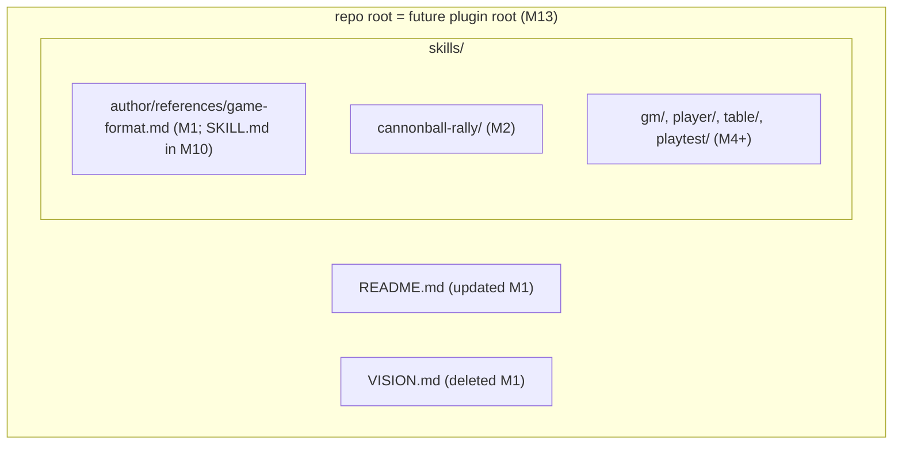

# Task: GAME.md Format Specification (M1)

* Task ID: m1-game-md-format-spec
* Complexity: Level 3
* Type: feature (foundational spec document)

Author the GAME.md format specification as an engine reference — required sections, content-table conventions, external data hooks with offline fallbacks, turn-report format rules — establish the repo layout it lives in, and retire `VISION.md`. Milestone M1 of the `lite-rpg-toolkit` L4 project; the spec is consumed by every later milestone (M2 proves it; M4 `gm`, M5 `player`, M7 `playtest`, M10 `author` read it or documents conforming to it).

## Pinned Info

### Repo layout (creative Q1 decision)

Pinned because every file created in this and later milestones lands inside this structure.

## Component Analysis

### Affected Components

- **`skills/author/references/game-format.md`** (new): the GAME.md format specification. Currently nothing exists → full document authored this milestone.
- **Repo layout** (new): first use of the `skills/` convention; this milestone creates the directory skeleton implicitly by placing the spec.
- **`VISION.md`** (deleted): seed material; memory bank absorbed it during L4 initialization → verify absorption, then delete.
- **`README.md`** (updated): currently a pitch with under-construction disclaimer → add repo layout and spec pointer.
- **`memory-bank/systemPatterns.md`** (updated): records designed architecture → record the now-real repo layout and spec location.
- **`memory-bank/techContext.md`** (updated): add the `skills/` layout convention.

### Cross-Module Dependencies

- Format spec → game documents (M2, M11, M12): games must satisfy the spec; M2 is the designated proving ground that fixes spec gaps it surfaces.
- Format spec → `gm` (M4): section vocabulary and conventions define what the GM parses and distills into turn briefs.
- Format spec → `playtest` (M7): the Parameters-table convention (creative Q2 discovery) is what makes rule-parameter sweeps mechanical.
- Format spec → `author` (M10): the spec's validation checklist seeds author's mechanical validation; the resolution-completeness questions seed its interrogation mode.
- Repo layout → plugin packaging (M13): repo root = plugin root; both harnesses auto-discover `skills/`.

### Boundary Changes

The spec IS a new public contract — the engine/content boundary itself. No existing interfaces change (greenfield).

### Invariants & Constraints

1. Paper-first parity — GAME.md prints as a rulebook; no machine scaffolding (creative Q2: pure Markdown).
2. GAME.md single source of truth — no parallel machine spec; no intra-document duplication.
3. Engine/content separation — the spec is engine; no Cannonball-Rally-specific rules leak into it (rally examples allowed as illustrations only).
4. Skills-only core — layout is agentskills.io-compatible (creative Q1).
5. Vendored `.cursor/{rules,skills,commands}/shared/` untouched.
6. Format must not preclude non-d6 dice or cards.

## Open Questions

- [x] **Q1: Repo layout** → Resolved: single top-level `skills/` directory for engine skills AND game directories; repo root doubles as plugin root (both Cursor and Claude plugins auto-discover root `skills/`); format spec lives at `skills/author/references/game-format.md` (author is its runtime owner; SKILL.md arrives in M10). (see `memory-bank/active/creative/creative-repo-layout.md`)
- [x] **Q2: Machine-anchoring strategy for GAME.md** → Resolved: pure structured Markdown — exact H2 section vocabulary, bold-label identity fields, GFM pipe tables, a named Parameters table for tunable values, structured hook subsections with table-based offline fallbacks, turn-report grammar as template + normative examples. No frontmatter, no hidden annotations: the machine reader is an LLM, so explicitness and consistency anchor the format, and print/machine needs converge. (see `memory-bank/active/creative/creative-game-md-anchoring.md`)

## Test Plan (TDD)

**No executable code lands in this milestone** — the deliverable is prose. Per L4 invariant 8, prose deliverables are validated by their proving milestone: the format is proven by M2 (Cannonball Rally). TDD's test-first cycle is therefore inapplicable here; validation is by documentary acceptance checks (below), each verifiable by inspection at QA.

### Behaviors to Verify (documentary acceptance checks)

- Spec defines a complete required-section vocabulary → every section from the vision (identity & flavor, core procedure, resolution, scoring & end state, content tables, GM guidance) plus Parameters (Q2 discovery) and turn report has: purpose, required content, conventions, and an inline mini-example.
- Spec defines content-table conventions → GFM pipe tables, one concept per table, column semantics defined.
- Spec defines the Parameters table → name/default/meaning columns; prose must reference parameters by name.
- Spec defines external-data hooks → optional section; per-hook required fields (input source, interpretation, offline fallback); fallback is itself a content table usable at a paper table.
- Spec defines turn-report format rules → per-game grammar as template line + normative examples; sized for a printed reference card (~a dozen words per player per round budget stated).
- Spec defines resolution completeness → enumerated questions every Resolution section must answer (dice, modifier stacking order, ties, simultaneity).
- Spec includes a validation checklist → mechanically derivable from the section rules (seed for `author`, M10).
- Spec stays game-agnostic → no rules of any specific game appear normatively (edge: rally examples are illustrative only and marked as such).
- Spec does not preclude non-d6 randomizers → dice declaration is per-game; spec language is randomizer-neutral (edge case check).
- `VISION.md` is deleted → every unique fact in it is traceable to the memory bank or the spec before deletion (edge: the six-unwritten-rules anecdote, build-order rationale, glossed-over list).
- `README.md` reflects reality → layout, spec pointer, game-library placeholder.
- Layout matches creative Q1 → spec at `skills/author/references/game-format.md`; nothing else added to `skills/`.

### Test Infrastructure

- Framework: none exists (per `techContext.md`) — and none is needed: no code in this milestone. Not a blocker; first code (M3 dice roller) introduces `bats` per shell-tdd rules.
- New test files: none.

### Integration Tests

- None executable. The real integration test of this spec is M2: authoring Cannonball Rally against it. M2 is explicitly scoped to surface and fix spec gaps.

## Implementation Plan

1. **Author the format spec** (the bulk of the milestone)
    - Files: `skills/author/references/game-format.md` (new)
    - Changes: full spec per creative Q2 conventions —
        - *Preamble*: purpose, the two audiences, paper-first parity rule ("if the AI needs something the paper doesn't say, fix the paper"), document-level conventions (H2 vocabulary, extension rule for unknown sections, identity bold-label fields).
        - *Per-section rules* for: Identity & Flavor; Parameters; Core Procedure (numbered algorithm, who acts, inputs/outputs per step); Resolution (completeness questions; randomizer-neutral); Scoring & End State; Content Tables (GFM conventions); Turn Report (grammar template + normative examples + word budget); External Data Hooks (optional; required fields + table-based offline fallback); GM Guidance. Each with an inline mini-example (illustrative, game-agnostic or marked rally-flavored).
        - *Validation checklist*: one checkable item per normative rule above.
    - Creative ref: `creative-game-md-anchoring.md` (conventions), `creative-repo-layout.md` (location).
2. **Update README.md**
    - Files: `README.md`
    - Changes: add repo layout section (`skills/` convention, engine vs game directories), link the format spec, game-library placeholder listing Cannonball Rally as in-progress.
3. **Retire VISION.md**
    - Files: `VISION.md` (delete)
    - Changes: diff its content against memory bank + spec; absorb anything unique (candidates: six-unwritten-rules anecdote → spec preamble or productContext; "glossed over on purpose" list → already in productContext); then delete.
4. **Update persistent memory bank**
    - Files: `memory-bank/systemPatterns.md`, `memory-bank/techContext.md`
    - Changes: systemPatterns — record realized repo layout (skills/, repo-root-as-plugin-root, spec location) and drop/adjust the pre-implementation status note's coverage of the format; techContext — add `skills/` layout convention under Repo Conventions.

## Technology Validation

No new technology — validation not required. (Plugin-discovery facts for the layout decision were verified against live Claude Code docs and the local Cursor plugin cache during creative Q1.)

## Challenges & Mitigations

- **Over-specification before any consumer exists**: the spec could mandate structure no game needs. → Keep each rule traceable to a vision requirement or a named consumer (gm/playtest/author); mark the spec as proven-pending-M2; M2 amendments are expected, not failures.
- **Under-specification discovered late**: gaps may only surface when M4's gm parses a real game. → M2 proving-ground scope catches authoring-side gaps; parsing-side gaps are in-scope amendments for M4 (spec is engine-internal until packaged, cheap to amend).
- **Turn-report rules designed before mixed tables exist (M8/M9)**: risk of speccing a protocol that contact with reality rewrites. → Spec defines only the *declaration format rules* (grammar template + examples + budget), not the table protocol; note refinement expected at M8.
- **VISION.md content loss**: deletion could orphan unabsorbed details. → Explicit absorption diff in step 3 before deletion; deletion is git-reversible regardless.
- **Scope creep into M2/M10**: temptation to draft rally content or author-skill behavior. → Hard rule: spec examples are illustrative snippets only; the validation checklist is content, not tooling.

## Status

- [x] Component analysis complete
- [x] Open questions resolved (2/2 via creative phase)
- [x] Test planning complete (TDD — documentary acceptance checks; no code in milestone)
- [x] Implementation plan complete
- [x] Technology validation complete (N/A — no new technology)
- [ ] Preflight
- [ ] Build
- [ ] QA
